<center><h1>小羽数据迁移使用文档</h1></center>

[TOC]

## 1. 文档说明

### 1.1 当前版本

当前版本 v1.0

修改日期：2023-08-08

### 1.2 修订文档历史记录

| 版本   | 更新内容 | 更新时间       |
|------|------|------------|
| v1.0 | 初稿   | 2023-08-08 |
|      |      |            |
|      |      |            |

## 2. 流程设计

### 2.1. 背景

小羽数据迁移是一款，全后台配置的数据迁移工具，扩展性高，后续可支持多种数据库；字段映射条件查询等简单操作支持一键配置，其他复杂的逻辑处理，可下载生成后的代码自行扩展。
[后台代码码云地址](https://gitee.com/wu_xiang_wei/xy-dash)     [前端代码码云地址](https://gitee.com/wu_xiang_wei/xy-dash-admin)    [b站视频演示地址](https://gitee.com/wu_xiang_wei/xy-dash)（待录制）

### 2.2 流程图

#### 2.2.1 操作流程图

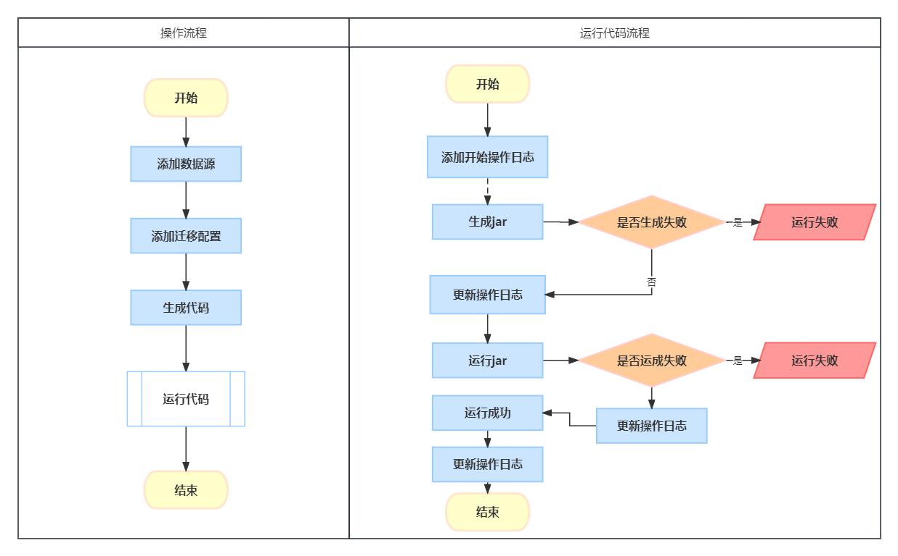

#### 2.2.1 数据迁移流程图

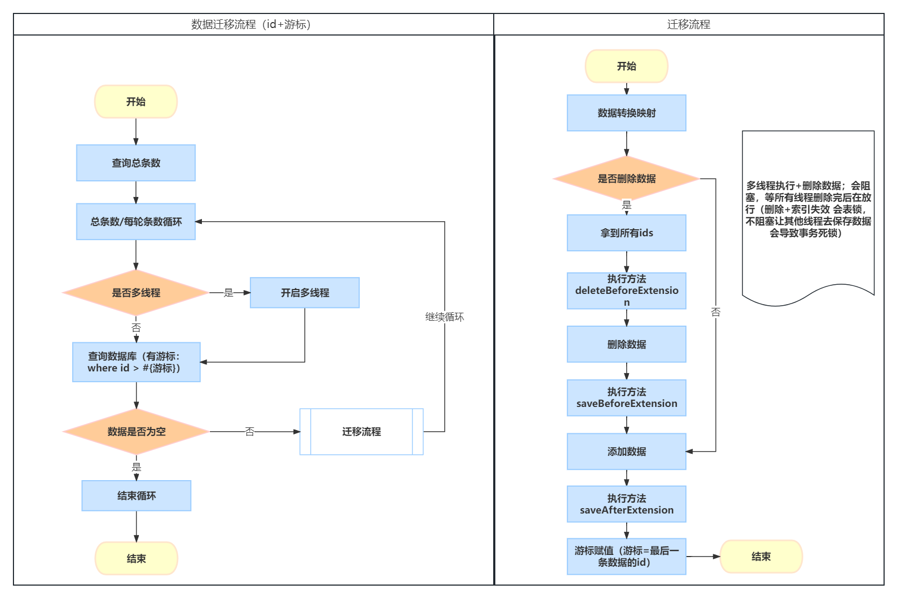

### 2.3 表结构设计

后补

## 3. 使用说明

### 3.1 运行代码

1. 下载代码
   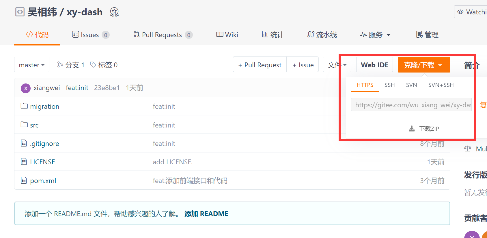

2. 执行sql文件，创建表
   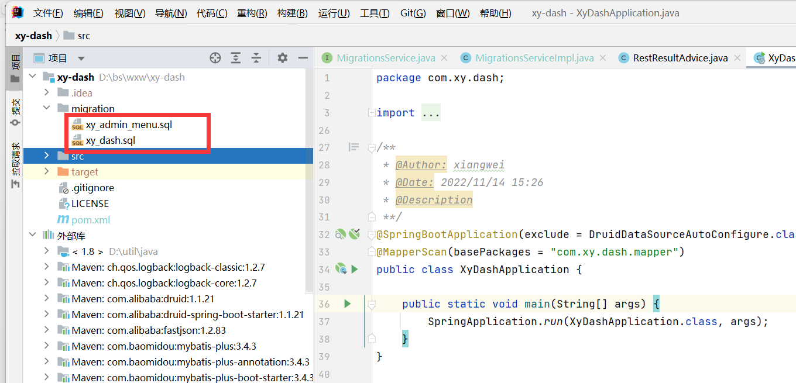

   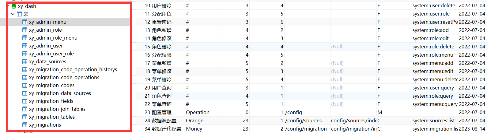

3. 修改mysql配置
   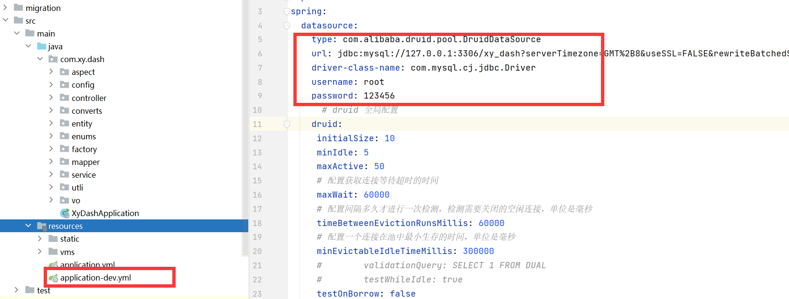
5. 运行代码
   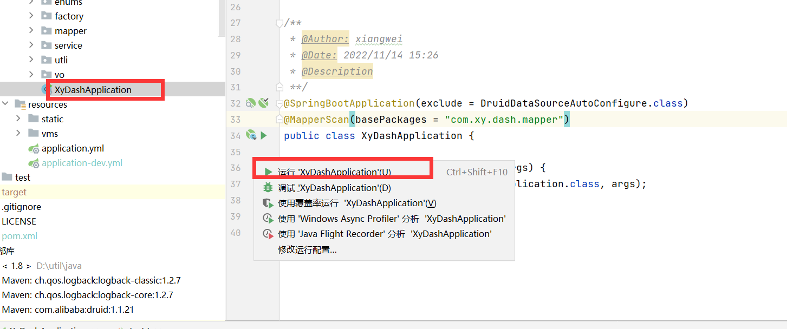

   

   

### 3.2 操作流程

配置数据源=》配置数据迁移=》表映射字段映射=》生成代码=》运行代码（下载代码 结束）=》查看运行日志=》结束

1. 配置数据源（目前只能mysql，后续增加sqlserver Oracle等数据库）
   
2. 配置数据迁移（支持多数据源）
   * 基础配置
     
   * 数据源和表配置
     
   * 字段映射-设置查询条件-关联条件
     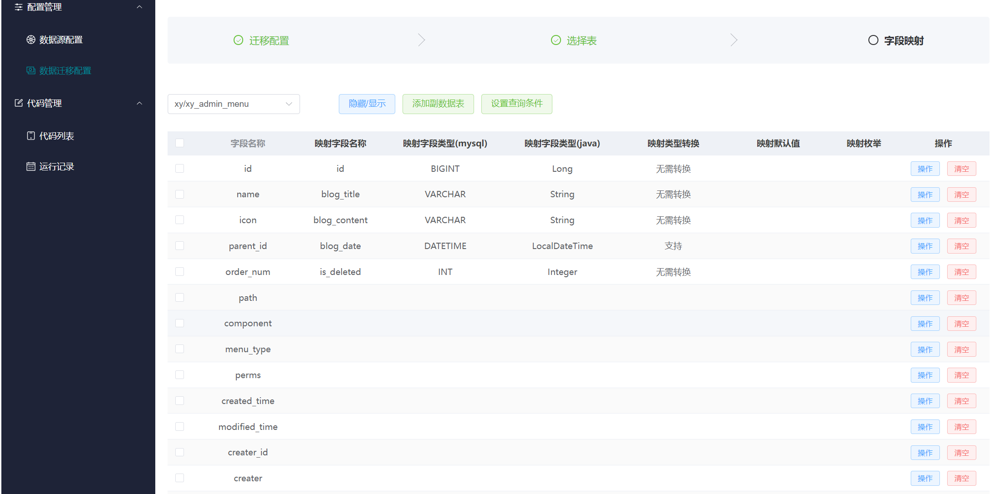

3. 生成代码
   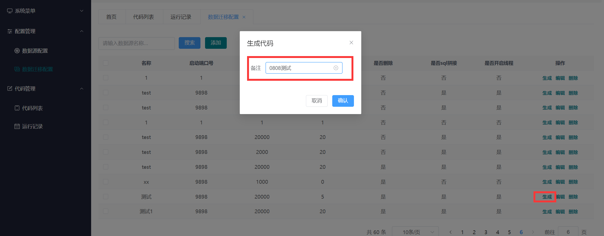

4. 运行代码
   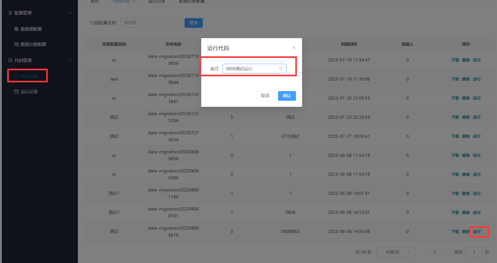

5. 查看日志
   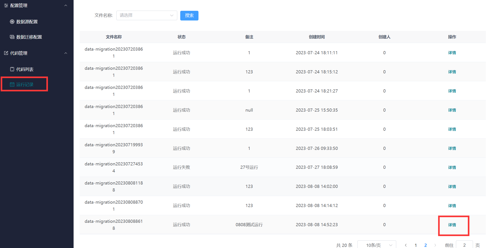

   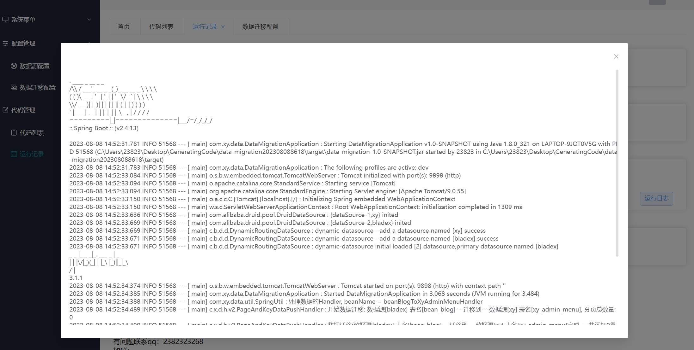

## 4.规划
### 4.1 需求ing

```
* 1. 映射id迁移，保存迁移和被迁移数据的id关联关系
* 2. 枚举映射
* 3. 连接查询嵌套 
* 4. 定时任务
* 5. 支持linux jar运行参数
* 6. 菜单用户权限jwt登录
* 7. 支持多种数据库
* 8. 分库分表旧数据（）一键配置迁移
```

### 4.2 结尾

> 山高凤必至，花香蝶自来，愿每个码农都能一览众山小。
> 有问题联系qq：2382323268 wx：wxw991203